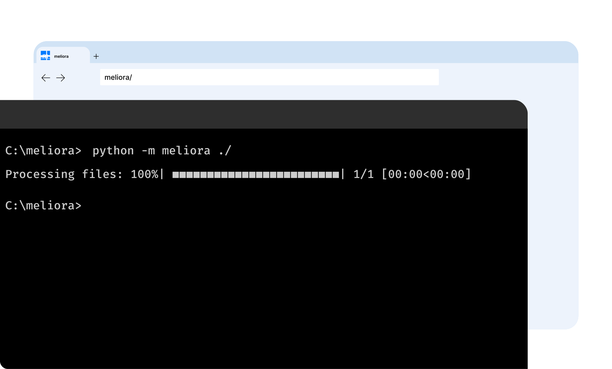

<center>

meliora is a command-line tool for sorting files based on their content. that's it. 


</center>

## Requirements
Python 3.x

## Installation


1. Clone the repository:
```shell
git clone https://github.com/somespi/meliora.git
```

2. Change into the project directory (**Do it twice**, one to enter the project directory and the other for entring the src):
```shell
cd meliora
```


3. Install the required dependencies:
```shell
pip install -r requirements.txt
```

4. Download the en_core_web_md model for Spacy:

```shell
python -m spacy download en_core_web_md
```


5. Install meliora:

- If you want to install it globally:
```shell
pip install .
```

- If you want to install it locally for development purposes:
```shell
pip install -e .
```

6. run meliora: 
```shell
python -m meliora <DIRECTORY_PATH>
```

